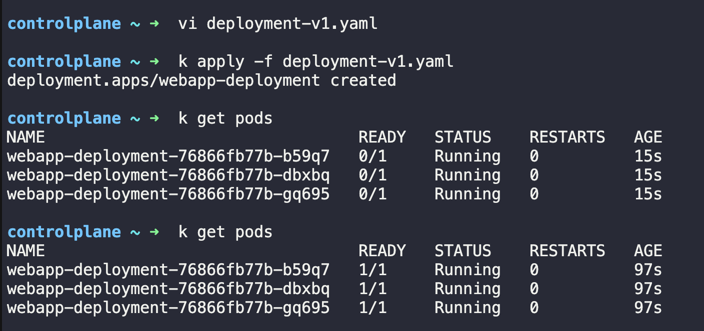
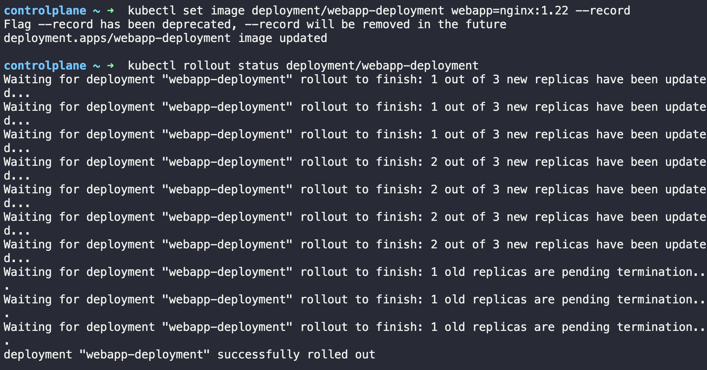
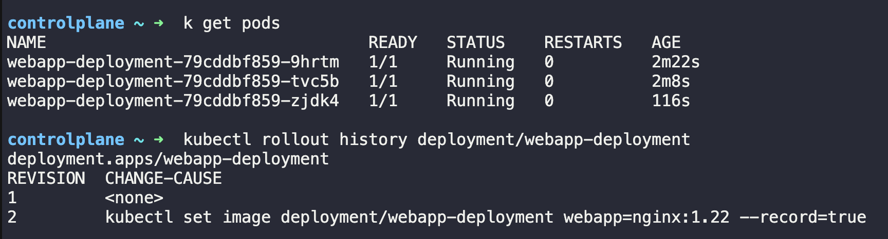
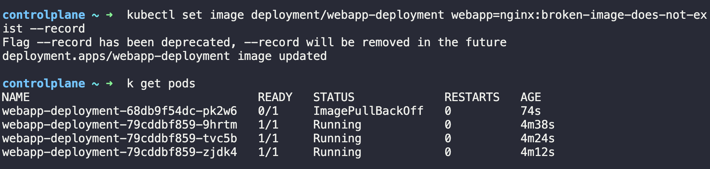
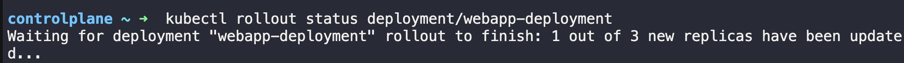
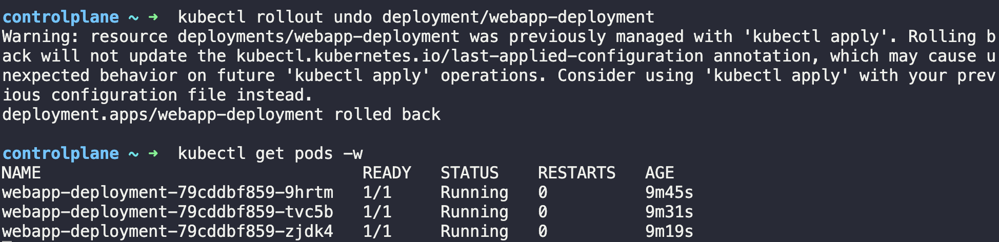
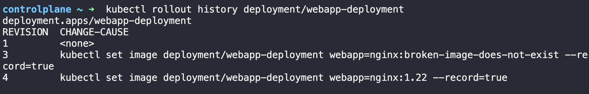

# ZeroDown: Kubernetes Zero-Downtime Deployments

## 📌 Project Overview
This project demonstrates how to configure and execute zero-downtime rolling updates and rollbacks in Kubernetes. By leveraging Readiness and Liveness probes alongside specific Deployment strategies (`maxUnavailable: 0`), we ensure that an application remains highly available even when a bad update (broken image tag) is intentionally introduced.

**Core Concepts Covered:**
*   Kubernetes Deployments & Pods
*   Rolling Updates & Rollbacks
*   Liveness & Readiness Probes
*   Deployment Strategies (`maxSurge` / `maxUnavailable`)

---

## 🛠️ The Initial Setup (v1)

We start by deploying version 1 of our web application using `nginx:1.21`. The deployment includes liveness and readiness probes to ensure Kubernetes knows exactly when a pod is alive and ready to receive traffic. Crucially, the deployment strategy is configured with `maxUnavailable: 0` to guarantee zero downtime.

**`deployment-v1.yaml`**
```yaml
apiVersion: apps/v1
kind: Deployment
metadata: 
  name: webapp-deployment
spec:
  replicas: 3
  selector:
    matchLabels:
      name: webapp
  strategy:
    type: RollingUpdate
    rollingUpdate:
      maxUnavailable: 0
      maxSurge: 1
  template:
    metadata:
      labels:
        name: webapp
    spec:
      containers:
      - name: webapp
        image: nginx:1.21
        readinessProbe:
          httpGet:
            path: /
            port: 80
          initialDelaySeconds: 5
          periodSeconds: 10
          failureThreshold: 3
        livenessProbe:
          httpGet:
            path: /
            port: 80
          initialDelaySeconds: 5
          periodSeconds: 10
```

---

## 🚀 Step-by-Step Execution

### 1. Deploy v1
Apply the manifest to the cluster and verify that the pods are running successfully.

```bash
kubectl apply -f deployment-v1.yaml
kubectl get pods
```
*Wait until all pods show `1/1 Running`.*



### 2. Rolling Update to v2
Trigger a rolling update by upgrading the container image to `nginx:1.22`. Watch the rollout status to see the pods updating one by one.

```bash
kubectl set image deployment/webapp-deployment webapp=nginx:1.22
kubectl rollout status deployment/webapp-deployment
```



### 3. Verify v2 is Running
Confirm that the new pods are up and running, and check the rollout history to see the new revision recorded.

```bash
kubectl get pods
kubectl rollout history deployment/webapp-deployment
```



### 4. Introduce an Intentionally Broken v3 
To test our zero-downtime safety net, we attempt to deploy a non-existent image. Kubernetes will try to pull this image, fail, and the new pod will enter an `ImagePullBackOff` state. 

```bash
kubectl set image deployment/webapp-deployment webapp=nginx:broken-image-does-not-exist
kubectl get pods
```
*Wait about 30 seconds to observe the `ImagePullBackOff` status alongside the healthy v2 pods.*



### 5. Watch the Rollout Stall
Because our readiness probes are failing on the broken pod, and our strategy demands `maxUnavailable: 0`, Kubernetes halts the rollout. The old v2 pods continue serving traffic smoothly—zero downtime is preserved!

```bash
kubectl rollout status deployment/webapp-deployment
```



### 6. Execute the Rollback
Since the v3 rollout is stuck, we perform a clean rollback to the stable v2 deployment. Watch the pods recover and the broken pod get terminated.

```bash
kubectl rollout undo deployment/webapp-deployment
kubectl get pods -w
```



### 7. Final Verification
Check the rollout history one last time to confirm that the deployment has successfully reverted and incremented the revision history.

```bash
kubectl rollout history deployment/webapp-deployment
```



## 🔧 What I'd Improve Next
- Add `--record` annotations via `kubernetes.io/change-cause` for cleaner history
- Configure a `progressDeadlineSeconds` to auto-fail stuck rollouts
- Add a Service in front of the deployment to demo live traffic during rollout